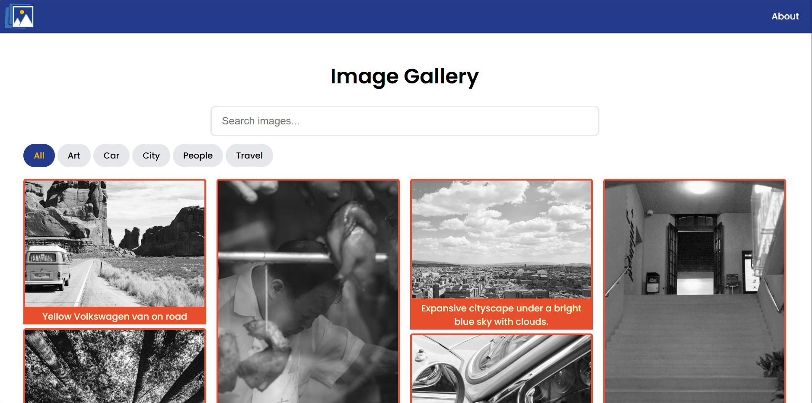
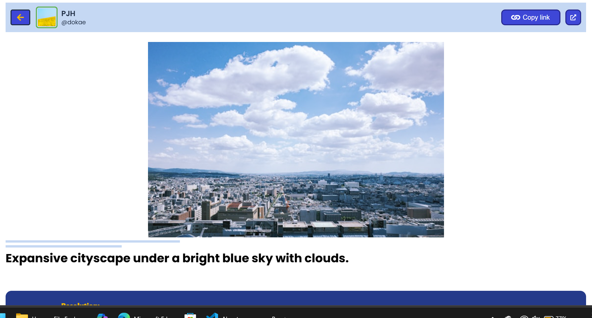
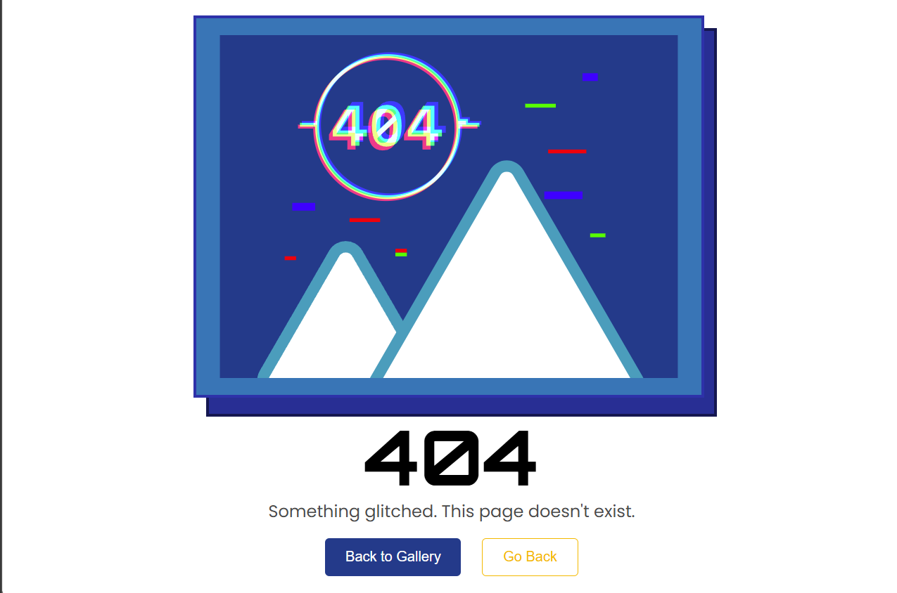

# React Image Gallery with View Transition based page transitions

A responsive image gallery built with React. This project integrates the Unsplash API fetch images, while focusing on presenting the data from the API cleanly, smooth navigation, and modern UI techniques.

The gallery allows users to search and filter images by category in their tags and keywords in their title, providing an engaging and efficient browsing experience. It also includes a detailed photo view with metadata, accessed by clicking the image on the homepage. Additionaly to improve the User experience, subtle UI micro animations in the form of View Transitions to improve the overall feel of navigation.

The project is designed as both a functional application and a case study, with an emphasis on clean structure, reusable components, and real-world frontend practices.

## Preview

### Home Page


### Photo Detail Page


### 404 Page


---

## Demo
<video src="./public/media/RIG-DemoVideo.mp4" autoplay loop muted playsinline controls width="800"></video>

## Features
* Search images using keywords
* Filter images by category
* Dynamic data fetching using the Unsplash API
* Cached API responses to reduce repeated requests
* Smooth navigation using the View Transitions API
* Skeleton loading states to reduce layout shift
* Responsive layout across different screen sizes
* Detailed photo view with metadata (location, author, resolution, etc.)

## Tech Stack
* React
* Vite
* React Router
* Unsplash REST API
* View Transition API

## Motivation

I built this project as a way to deepen my understanding of working with real-world APIs in React, programing functionaliy whilst also focusing on user experience and performance.

I wanted to move beyond basic projects and create something that feels closer to a production-ready application. This included thinking about how users interact with the interface, how to reduce perceived loading times, and how to structure data efficiently.

The project also gave me an opportunity to explore newer browser features such as the View Transitions API, and to combine my interest in UI design with practical frontend engineering needed in real businwss applications.

## Getting Started
### 1. Clone the repository
```bash
git clone https://github.com/dane679/React-Image-Gallery.git
cd React-Image-Gallery 
```

### 2. Install dependencies

```bash
npm install
```

### 3. Run the development server

```bash
npm run dev
```
## How It Works

### Fetching Data

Image data is fetched using an async function:

```js
const data = await imageCollector(photoId);
```

* The API response is transformed into a cleaner structure before use
* Only relevant fields (tags, urls, metadata) are kept

### Filtering
Filtering is handled client-side:

```js
const filteredImages = allImages.filter((image) => {
  return matchesCategory && matchesSearch;
});
```
* Category filtering uses tags returned from the API
* Search filtering matches against the image description

### Caching
Caching is implemented to reduce unnecessary API calls:

```js
const cached = getFromCache(cacheKey);
```
* Previously fetched images are stored and reused
* Improves performance when navigating between pages

## Customisation
### Modify Filtering Logic

Filtering behaviour can be adjusted inside:

```bash
Home.jsx
```

Look for:

```js
matchesCategory
matchesSearch
```

### Update Styling / Animations

All layout and animation styles are handled in:

```bash
styles.css
```

This includes:

- gallery layout
- hover effects
- view transition animations

## Support

If you found this useful or interesting, consider giving the repo a star!

## License

This project is open-source and available under the MIT License.


## Attribution

This project uses the **Unsplash API** to fetch and display images.

- All images are provided by photographers on Unsplash  
- Image ownership and copyrights belong to their respective creators  
- Where applicable, links to the original image and creator profiles are included within the application

This project is a non-commercial portfolio piece and is intended to demonstrate frontend development practices, and does not claim ownership of any external media content.